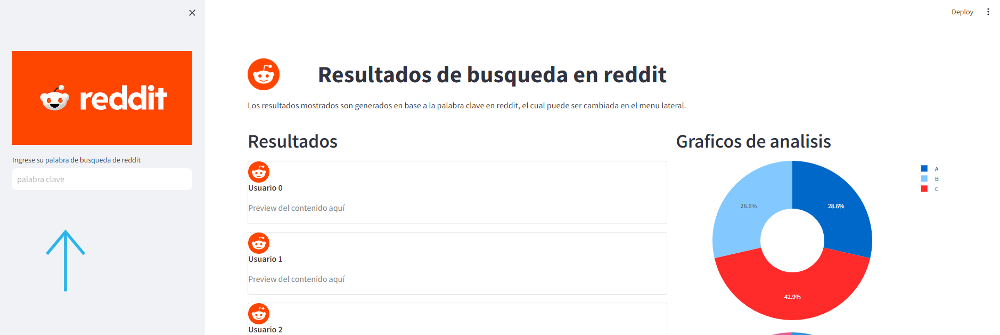

# Análisis de Sentimiento de Reddit

Esta aplicación permite analizar el sentimiento de publicaciones en Reddit basado en una palabra clave de búsqueda.

## Características

- Búsqueda de publicaciones en Reddit por palabra clave
- Análisis de sentimiento de los títulos de las publicaciones
- Visualización de resultados en gráficos
- Diseño responsivo con Streamlit

## Instalación

1. Clonar el repositorio
   ```bash
   git clone https://github.com/Albres20/GPT3-Dataset-Generator-V2.git
   ```
2. Instalar requerimientos
   ```bash
   pip install -r requirements.txt
   ```
3. Ejecutar la aplicación
   ```bash
   python -m streamlit run .\streamlit_app.py
   ```

## Uso

1. Ejecutar la aplicación con `python -m streamlit run .\streamlit_app.py
`
2. Ingresar palabra clave de búsqueda en la barra lateral
3. La aplicación buscará publicaciones recientes en Reddit
4. Se analizará el sentimiento de los títulos (positivo, negativo, neutral)
5. Los resultados se mostrarán en:
    - Gráfico circular de distribución de sentimientos
    - Tarjetas con preview de las publicaciones
6. Permite interacción con los gráficos y scroll en las tarjetas

## Tecnologías

- Python
- Streamlit
- pandas
- Matplotlib
- textblob (análisis de sentimiento)

## Capturas




